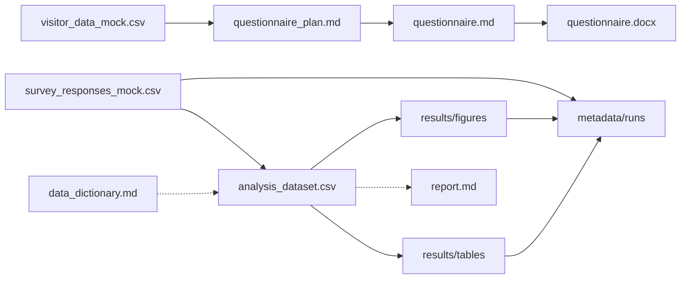

# Aquarium and Romance

## 水族館体験と感情・人間関係に関する探索的研究

> 本リポジトリは研究ワークフロー管理を実証するための架空プロジェクトです。
> 使用されるデータはすべて人工的に作成されたもの、または公開を想定したサンプルデータです。

---

# 概要

水族館は、生物展示や空間体験を通じて来館者に印象的な経験を提供する。

本研究では、水族館への訪問経験が来館者の感情評価や対人関係、再訪意向にどのように関連するかを探索的に解析する。

本プロジェクトの目的は、水族館に関する科学的結論を得ることではなく、以下の研究プロセスを再現可能な形で管理することである。

- 外部データによる探索
- 研究課題の設定
- アンケート設計
- データ処理
- 解析
- 結果の文書化

---

# Research Question

## Main Question

水族館での体験は、来館者の感情や認識にどのような影響を与えるか？

## Sub Questions

1. 印象的な水族館体験にはどのような特徴があるか？

2. 来館者属性や訪問条件は、体験評価とどのように関連するか？

3. 水族館体験には複数のパターンが存在するか？

---

# 研究ワークフロー



## 1. 外部データによる探索

既存情報を利用して、研究対象の傾向を把握し、アンケート設計の基礎とする。

利用例：

- 来館者統計
- 訪問頻度
- 展示エリア利用状況
- 滞在時間
- 満足度指標

実際の顧客データは機密情報として扱い、本リポジトリには保存しない。

開発・検証用として人工データのみを配置する。

```
data/
├── external/
│   └── README.md
│
└── mock/
    └── visitor_data_mock.csv
```

---

## 2. アンケート調査

外部データから得られた傾向をもとに、来館者体験に関するアンケートを設計する。

アンケート設計は Markdown を正本とし、配布用紙は Word（docx）へ変換する。

```
設計メモ（questionnaire_plan.md）
   |
   v
設問正本（questionnaire.md）
   |
   v  pandoc
配布用紙（questionnaire.docx）
   |
   v  Word でフォント・体裁を微調整
印刷・配布
```

```
docs/
└── questionnaire/
    ├── questionnaire_plan.md
    ├── questionnaire.md
    └── questionnaire.docx
```

調査項目例：

- 訪問目的
- 同伴者
- 印象に残った展示
- 感情評価
- 訪問時の体験
- 再訪意向

### 配布用紙の生成

```bash
pandoc docs/questionnaire/questionnaire.md \
  -o docs/questionnaire/questionnaire.docx
```

生成後、Word で日本語フォントやチェックボックスの体裁を手動調整する想定である。本リポジトリの `questionnaire.docx` はその成果物のモックである。

---

## 3. データ処理・解析

アンケート回答データを処理し、再現可能な解析を実行する。

解析フロー：

```
Raw data
   |
   v
データクリーニング
   |
   v
解析用データセット作成
   |
   v
統計解析
   |
   v
図表生成
```

---

## 4. 結果の文書化

研究計画、解析方法、結果を文書として保存する。

例：

```
docs/
├── research_plan.md
├── data_dictionary.md
└── report.md
```

---

# リポジトリ構造

```
aquarium_romance/

├── README.md
├── main.py
│
├── data/
│   ├── external/
│   │   └── README.md
│   │
│   ├── mock/
│   │   └── visitor_data_mock.csv
│   │
│   └── processed/
│       └── analysis_dataset.csv
│
├── docs/
│   ├── questionnaire/
│   │   ├── questionnaire_plan.md
│   │   ├── questionnaire.md
│   │   └── questionnaire.docx
│   │
│   ├── research_plan.md
│   ├── data_dictionary.md
│   └── report.md
│
├── scripts/
│   ├── generate_mock_data.py
│   └── run_analysis.py
│
├── src/
│   ├── config.py
│   ├── logger/
│   ├── preprocessing/
│   │   └── clean_data.py
│   │
│   ├── analysis/
│   │   └── analyze_experience.py
│   │
│   └── visualization/
│       └── plot_results.py
│
├── results/
│   ├── figures/
│   └── tables/
│
└── metadata/
    └── runs/
```

---

# データ管理方針

## 機密データ

実際の研究では、以下のような情報は適切なアクセス管理下で管理する。

例：

- 個人識別情報
- 顧客履歴
- 利用履歴
- 非公開アンケート回答

これらのデータはGitリポジトリには保存しない。

---

## Mock Data

人工データは以下の目的で利用する。

- 開発
- テスト
- 解析パイプライン確認
- 再現可能な研究環境の構築

mock dataは実データと同じ構造を持つことで、実際の研究開発環境を再現する。

---

# 解析の再現

本プロジェクトは [uv](https://docs.astral.sh/uv/) で依存関係を管理する。

## 環境構築

```bash
cd mock_project/aquarium_and_romance
uv sync
```

## 解析ワークフロー

標準エントリはプロジェクトルートの `main.py` のみ。

```bash
uv run python main.py
```

実行ごとに `metadata/runs/{run_id}.yaml` へ、`main.py` で宣言した入力・出力と Git 状態・実行環境が記録される。

```python
with ResearchRun(entrypoint="main.py") as run:
    run.input(SURVEY_RESPONSES_MOCK)
    run.output(RESULTS_DIR)
    run_analysis()
```

`run.output()` には出力ルート（例: `results/`）だけを渡す。配下の生成・更新・削除は実行前後のスナップショット差分で記録する。

生成物：

```
results/
├── figures/
└── tables/

metadata/runs/
└── {run_id}.yaml
```

## 依存パッケージ

| パッケージ | 用途 |
|-----------|------|
| pandas | データ処理・集計 |
| matplotlib | 図表生成 |
| pyyaml | 実行メタデータ（`metadata/runs/`）の出力 |

アンケート用紙の docx 変換には [pandoc](https://pandoc.org/)（システム依存）を用いる。Python パッケージには含めない。

---

# 研究資産管理

研究成果は最終的な図表や論文だけではなく、以下の要素から構成される。

- 研究課題
- アンケート設計
- データ定義
- データ処理スクリプト
- 解析コード
- 生成された結果
- 研究記録

本リポジトリでは、研究活動を再利用可能かつ再現可能な資産として管理する方法を示す。
